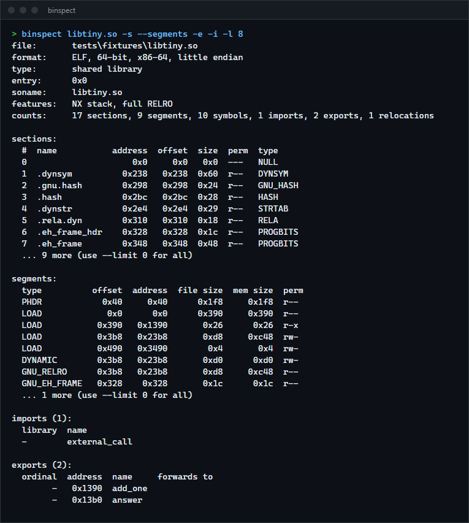
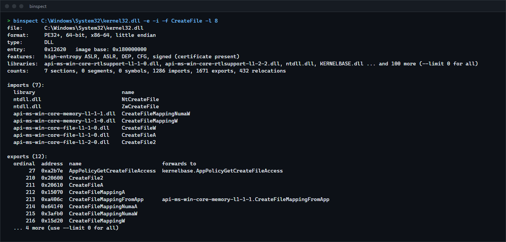

# Binary inspector

`binspect` reads Linux ELF and Windows PE executables and shows their headers, sections, segments, symbols, imports, exports and relocations in one consistent layout. For anyone learning how executables are laid out, or checking a binary for hardening features, without separate tools per platform.

**Status:** v0.1.0, working. Cross-checked against `llvm-readobj` on real files.



## Features

- One model for both formats: the parsers fill a shared `Binary` structure and the renderers read only that, so the same flags and columns work on ELF and PE.
- ELF32 and ELF64, little and big endian: program headers, sections, `.symtab` and `.dynsym`, imports and exports, REL and RELA relocations with symbol names, interpreter, `DT_NEEDED` libraries, soname.
- PE32 and PE32+: sections, import table, delay-load imports, export table with ordinals and forwarders, base relocations.
- Hardening report: ELF shows PIE, NX stack, partial or full RELRO, stack protector, stripped; PE shows ASLR, high-entropy ASLR, DEP, CFG and whether a certificate is present.
- Bounds-checked reader: a truncated or corrupt file gives an error or a partial result with a note, never a panic or an out-of-range read.
- `--json` prints the whole model.

## How to install

Needs a Rust toolchain.

```sh
git clone https://github.com/r3clusionn/binary-inspector
cd binary-inspector
cargo install --path .
```

## How to use

```sh
binspect program                    # summary, sections and segments
binspect program --imports --exports
binspect lib.dll --exports --filter CreateFile
binspect program --all --limit 0    # every table, every row
binspect program --json
```

Output for a small shared library built with rust-lld (the fixture in `tests/fixtures`):

```text
format:     ELF, 64-bit, x86-64, little endian
type:       shared library
entry:      0x0
soname:     libtiny.so
features:   NX stack, full RELRO
counts:     17 sections, 9 segments, 10 symbols, 1 imports, 2 exports, 1 relocations

imports (1):
  library  name
  -        external_call

exports (2):
  ordinal  address  name     forwards to
        -   0x1390  add_one
        -   0x13b0  answer
```

And for a Windows DLL, `binspect C:\Windows\System32\kernel32.dll -e -f CreateFileW` (the `libraries:` line, 104 DLLs, is left out here):

```text
format:     PE32+, 64-bit, x86-64, little endian
type:       DLL
entry:      0x12620   image base: 0x180000000
features:   high-entropy ASLR, ASLR, DEP, CFG, signed (certificate present)
counts:     7 sections, 0 segments, 0 symbols, 1286 imports, 1671 exports, 432 relocations

exports (2):
  ordinal  address  name           forwards to
      219  0x20620  CreateFileW
      985  0x3d330  LZCreateFileW
```

| Option | What it does |
|---|---|
| `-s`, `--sections` | Section table. With `--segments` (program headers) this is the default view when nothing is chosen. |
| `-y`, `--symbols` | Symbol tables. |
| `-i`, `--imports`, `-e`, `--exports` | Imports and exports. |
| `-r`, `--relocs` | Relocations. |
| `-a`, `--all` | All of the above. |
| `-f TEXT` | Only names containing TEXT (symbols, imports, exports). |
| `-l N` | Rows per table, 0 for all (default 40). |
| `--json` | The whole model as JSON. |

Exit status: 0 success, 1 not a valid ELF or PE file, 2 file could not be read.



## How it works

`src/reader.rs` is the only code that touches raw bytes: every read checks bounds and returns an
error instead of indexing. `src/elf.rs` and `src/pe.rs` walk the headers and tables through it and
fill the shared model in `src/model.rs`. Tables whose counts come from the file are capped at two
million entries so a corrupt count cannot exhaust memory, and the cap is reported in `notes`.

## Verification

Counts below come from running `binspect` and `llvm-readobj` (the one shipped with the Rust
toolchain) on the same files:

| File | What matched |
|---|---|
| Static-PIE ELF, 4.8 MB, built with rustc and rust-lld for `x86_64-unknown-linux-musl` | 35 sections, 10 program headers, 1663 symbols (1664 with the null entry), 703 relocations, entry point, type |
| ELF object `tiny.o` | all 6 relocations: offsets, types, addends and symbol names (section symbols are named after their section) |
| `kernel32.dll` | 7 sections, 1671 exports, 1286 import symbols including 18 delay-load |
| `notepad.exe` | 7 sections, 340 import symbols including 25 delay-load |
| `binspect.exe` itself | 5 sections, 89 import symbols, 650 relocations |

LLVM also lists the padding entries in PE relocation blocks (2, 3 and 8 in the three PE files
above), which `binspect` leaves out, so its raw entry counts are higher by that amount. Only
x86-64 was tested against real files; other architectures are read by the same code but their
relocation names are numbers unless listed in `src/elf.rs`.

## Tests

`cargo test` runs 19 tests: the reader, synthetic ELF64 and PE32+ files built byte by byte with
known contents, a sweep that parses every truncation of both and 8,000 random byte mutations
(with overflow checks on) without a panic, the two real ELF fixtures, a real Windows DLL and the
test binary itself, and the command line.

## License

MIT (see `LICENSE`).
